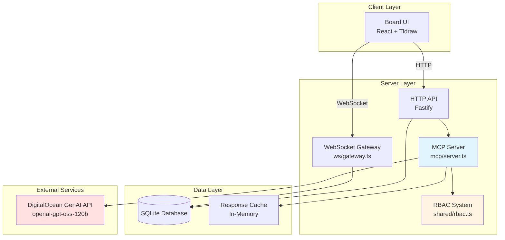
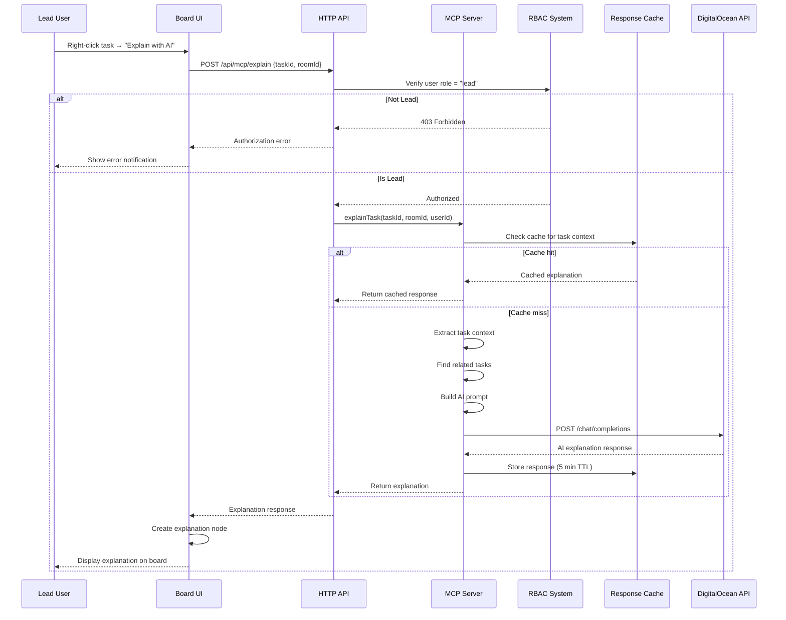
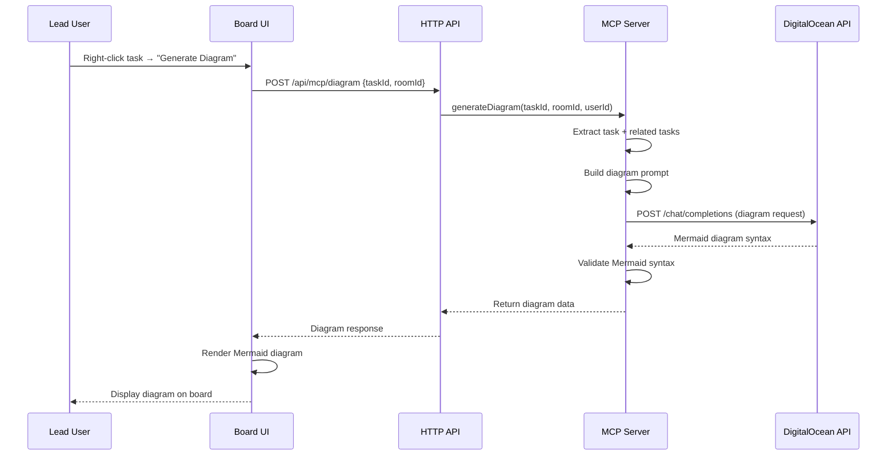
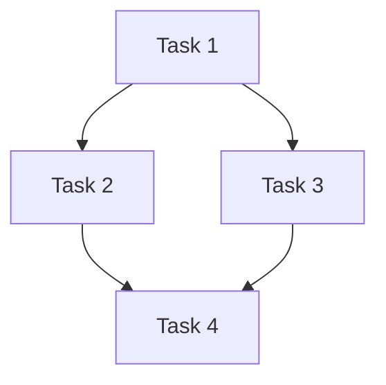

# Design Document: MCP Board AI Explainer

## Overview

The MCP Board AI Explainer feature extends the existing Board collaborative workspace with AI-powered task explanation and diagram generation capabilities. This feature integrates a Model Context Protocol (MCP) server that connects to DigitalOcean's GenAI API, enabling Lead users to request contextual explanations and visual diagrams for tasks on the board.

### Key Design Goals

1. **Seamless Integration**: Leverage existing Board infrastructure (WebSocket gateway, RBAC system, event system) without disrupting current functionality
2. **Role-Based Access**: Restrict AI features to Lead users only, enforcing access control at multiple layers
3. **Context-Aware AI**: Provide rich task context to the AI model including related tasks, room participants, and task metadata
4. **Visual Clarity**: Generate diagrams that help users understand task relationships and workflows
5. **Performance**: Implement caching, rate limiting, and connection pooling to ensure responsive user experience
6. **Graceful Degradation**: Handle missing configuration or API failures without breaking the core Board functionality

### Architecture Principles

- **Separation of Concerns**: MCP server handles AI operations independently from core Board logic
- **Defense in Depth**: Multiple layers of authorization checks (RBAC, MCP server, API gateway)
- **Fail-Safe Design**: Missing AI configuration disables features rather than causing crashes
- **Observable System**: Comprehensive logging and metrics for monitoring and debugging

## Architecture

### System Components



### Component Interaction Flow

#### Explanation Request Flow



#### Diagram Generation Flow



### Deployment Architecture

The MCP server will be deployed as part of the existing Fastify server process:

- **Development**: Runs alongside the Fastify dev server on localhost
- **Production**: Deployed to DigitalOcean App Platform as part of the server container
- **Configuration**: Environment variables for DigitalOcean API credentials
- **Scaling**: Shares the same scaling characteristics as the main server

## Components and Interfaces

### 1. MCP Server (`apps/server/src/mcp/server.ts`)

The MCP server is the core component that handles AI explanation requests.

#### Responsibilities

- Implement MCP protocol specification
- Authenticate and authorize requests
- Extract task context from the Board system
- Communicate with DigitalOcean GenAI API
- Cache responses to improve performance
- Enforce rate limits per user
- Log requests and errors for monitoring

#### Key Methods

```typescript
interface MCPServer {
  // Initialize the MCP server with configuration
  initialize(config: MCPConfig): Promise<void>;
  
  // Handle explanation request for a specific task
  explainTask(request: ExplanationRequest): Promise<ExplanationResponse>;
  
  // Generate diagram for a task and its relationships
  generateDiagram(request: DiagramRequest): Promise<DiagramResponse>;
  
  // Health check endpoint
  healthCheck(): Promise<HealthStatus>;
  
  // Shutdown gracefully
  shutdown(): Promise<void>;
}

interface MCPConfig {
  doAiEndpoint: string;
  doAiApiKey: string;
  doAiModel: string;
  cacheEnabled: boolean;
  cacheTTLSeconds: number;
  rateLimitPerMinute: number;
  maxRelatedTasks: number;
  proximityRadius: number;
}
```

### 2. AI Explainer (`apps/server/src/mcp/explainer.ts`)

Handles the logic for generating AI explanations.

#### Responsibilities

- Extract task context (text, intent, author, timestamp)
- Find related tasks within proximity radius
- Build structured prompts for the AI model
- Parse and validate AI responses
- Handle API errors and retries

#### Key Methods

```typescript
interface AIExplainer {
  // Extract full context for a task
  extractTaskContext(taskId: string, roomId: string): Promise<TaskContext>;
  
  // Find related tasks within proximity
  findRelatedTasks(taskId: string, roomId: string, radius: number): Promise<Task[]>;
  
  // Build AI prompt from task context
  buildExplanationPrompt(context: TaskContext): string;
  
  // Call DigitalOcean API and parse response
  generateExplanation(prompt: string): Promise<string>;
}

interface TaskContext {
  task: Task;
  relatedTasks: Task[];
  roomParticipants: Participant[];
  roomName: string;
}

interface Task {
  id: string;
  text: string;
  intent: 'action' | 'decision' | 'question' | 'reference';
  authorName: string;
  authorRole: 'Lead' | 'Contributor' | 'Viewer';
  createdAt: string;
  position: { x: number; y: number };
}
```

### 3. Diagram Generator (`apps/server/src/mcp/diagram.ts`)

Generates visual diagrams using Mermaid syntax.

#### Responsibilities

- Analyze task relationships
- Determine appropriate diagram type (flowchart, graph, timeline)
- Generate Mermaid syntax
- Validate diagram structure
- Limit diagram complexity

#### Key Methods

```typescript
interface DiagramGenerator {
  // Analyze tasks and determine diagram type
  analyzeDiagramType(tasks: Task[]): DiagramType;
  
  // Generate Mermaid diagram syntax
  generateMermaidDiagram(tasks: Task[], type: DiagramType): string;
  
  // Validate Mermaid syntax
  validateDiagram(mermaidSyntax: string): boolean;
}

type DiagramType = 'flowchart' | 'graph' | 'timeline';
```

### 4. Response Cache (`apps/server/src/mcp/cache.ts`)

In-memory cache for explanation responses.

#### Responsibilities

- Cache explanation responses by task context hash
- Implement TTL-based expiration
- Provide cache statistics for monitoring

#### Key Methods

```typescript
interface ResponseCache {
  // Get cached response
  get(key: string): ExplanationResponse | null;
  
  // Store response with TTL
  set(key: string, response: ExplanationResponse, ttlSeconds: number): void;
  
  // Clear expired entries
  cleanup(): void;
  
  // Get cache statistics
  getStats(): CacheStats;
}

interface CacheStats {
  hits: number;
  misses: number;
  size: number;
  hitRate: number;
}
```

### 5. Rate Limiter (`apps/server/src/mcp/rate-limiter.ts`)

Enforces per-user rate limits.

#### Responsibilities

- Track requests per user per time window
- Reject requests exceeding limits
- Reset counters after time window

#### Key Methods

```typescript
interface RateLimiter {
  // Check if user can make a request
  checkLimit(userId: string): boolean;
  
  // Record a request for a user
  recordRequest(userId: string): void;
  
  // Get remaining requests for a user
  getRemainingRequests(userId: string): number;
}
```

### 6. Board Integration (`apps/web/src/mcp-integration.ts`)

Client-side integration with the Board UI.

#### Responsibilities

- Add context menu actions for AI features
- Send explanation/diagram requests to API
- Create and render explanation nodes
- Handle loading states and errors
- Manage explanation node lifecycle

#### Key Methods

```typescript
interface MCPIntegration {
  // Initialize MCP integration with editor
  initialize(editor: Editor, userRole: UserRole): void;
  
  // Request explanation for a task
  requestExplanation(taskId: TLShapeId): Promise<void>;
  
  // Request diagram for a task
  requestDiagram(taskId: TLShapeId): Promise<void>;
  
  // Create explanation node on canvas
  createExplanationNode(taskId: TLShapeId, explanation: string): void;
  
  // Create diagram node on canvas
  createDiagramNode(taskId: TLShapeId, mermaidSyntax: string): void;
}
```

## Data Models

### Explanation Request

```typescript
interface ExplanationRequest {
  taskId: string;
  roomId: string;
  userId: string;
  includeRelatedTasks: boolean;
  proximityRadius?: number; // Default: 500 pixels
}
```

### Explanation Response

```typescript
interface ExplanationResponse {
  taskId: string;
  explanation: string;
  relatedTaskIds: string[];
  generatedAt: string;
  tokenCount: number;
  cached: boolean;
}
```

### Diagram Request

```typescript
interface DiagramRequest {
  taskId: string;
  roomId: string;
  userId: string;
  diagramType?: DiagramType; // Auto-detect if not specified
  maxNodes?: number; // Default: 20
}
```

### Diagram Response

```typescript
interface DiagramResponse {
  taskId: string;
  diagramType: DiagramType;
  mermaidSyntax: string;
  includedTaskIds: string[];
  generatedAt: string;
}
```

### Task Node Metadata

Explanation and diagram nodes will use the existing `LigmaNodeMeta` structure with additional fields:

```typescript
interface ExplanationNodeMeta extends LigmaNodeMeta {
  nodeType: 'explanation' | 'diagram';
  sourceTaskId: string;
  generatedAt: string;
  aiModel: string;
}
```

### DigitalOcean API Request

```typescript
interface DOAIRequest {
  model: string; // "openai-gpt-oss-120b"
  messages: Array<{
    role: 'system' | 'user' | 'assistant';
    content: string;
  }>;
  max_tokens: number;
  temperature: number;
}
```

### DigitalOcean API Response

```typescript
interface DOAIResponse {
  id: string;
  object: string;
  created: number;
  model: string;
  choices: Array<{
    index: number;
    message: {
      role: string;
      content: string;
    };
    finish_reason: string;
  }>;
  usage: {
    prompt_tokens: number;
    completion_tokens: number;
    total_tokens: number;
  };
}
```

## Security Design

### Authentication and Authorization

#### Multi-Layer Authorization

1. **HTTP API Layer**: Verify JWT token and extract user ID
2. **RBAC Layer**: Check user role in the specific room
3. **MCP Server Layer**: Validate user has "lead" role before processing

#### Authorization Flow

```typescript
async function authorizeExplanationRequest(
  request: ExplanationRequest
): Promise<AuthorizationResult> {
  // Layer 1: Verify JWT token
  const claims = await verifyToken(request.token);
  if (!claims) {
    return { authorized: false, reason: 'invalid_token' };
  }
  
  // Layer 2: Get user role in room
  const role = getRoleInRoom(claims.sub, request.roomId);
  if (!role) {
    return { authorized: false, reason: 'not_room_member' };
  }
  
  // Layer 3: Check if role is "lead"
  if (role !== 'Lead') {
    return { authorized: false, reason: 'insufficient_permissions' };
  }
  
  return { authorized: true, userId: claims.sub, role };
}
```

### API Key Security

- DigitalOcean API key stored in environment variable `DO_AI_API_KEY`
- Never exposed to client-side code
- Never logged in plain text
- Validated on server startup

### Rate Limiting

- Per-user rate limit: 10 requests per minute
- Prevents abuse and controls costs
- Returns 429 status code when exceeded
- Resets every 60 seconds

### Input Validation

- Sanitize all user inputs before sending to AI
- Validate task IDs exist and user has access
- Limit prompt length to prevent token exhaustion
- Validate Mermaid syntax before returning to client

## UI/UX Design

### Context Menu Integration

When a Lead user right-clicks on a task node, the context menu will include:

```
┌─────────────────────────────┐
│ Copy                        │
│ Delete                      │
│ Lock to Roles...            │
├─────────────────────────────┤
│ ✨ Explain with AI          │
│ 📊 Generate Diagram         │
└─────────────────────────────┘
```

For non-Lead users, these options are hidden.

### Explanation Node Rendering

Explanation nodes will have a distinct visual style:

- **Background**: Light blue gradient (#e1f5ff to #f0f9ff)
- **Border**: Dashed border with AI sparkle icon
- **Header**: "AI Explanation" with timestamp
- **Content**: Markdown-formatted explanation text
- **Footer**: "Generated by AI • [Model Name]"
- **Link**: Visual connector line to source task

### Diagram Node Rendering

Diagram nodes will render Mermaid diagrams:

- **Background**: White with subtle shadow
- **Border**: Solid border with diagram icon
- **Header**: "Diagram: [Type]" with timestamp
- **Content**: Rendered Mermaid diagram
- **Controls**: Zoom in/out, fullscreen view

### Loading States

While waiting for AI response:

- Show spinner overlay on source task
- Display "Generating explanation..." tooltip
- Disable additional requests for same task
- Timeout after 15 seconds with error message

### Error Notifications

Errors displayed as non-intrusive toast notifications:

- **API Unavailable**: "AI service temporarily unavailable. Please try again later."
- **Rate Limited**: "Too many requests. Please wait a moment and try again."
- **Insufficient Context**: "This task needs more details for AI explanation."
- **Configuration Missing**: "AI features are not configured. Contact your administrator."

## Error Handling

### Error Categories

#### 1. Configuration Errors

**Scenario**: Missing or invalid DigitalOcean API credentials

**Handling**:
- Log error on server startup
- Disable AI features in UI (hide menu options)
- Return 503 Service Unavailable for API requests
- Display admin-friendly error message in logs

#### 2. Authentication Errors

**Scenario**: Invalid JWT token or unauthorized user

**Handling**:
- Return 401 Unauthorized for invalid tokens
- Return 403 Forbidden for non-Lead users
- Log authorization failures for audit
- Display user-friendly error in UI

#### 3. API Errors

**Scenario**: DigitalOcean API returns error or times out

**Handling**:
- Retry once with exponential backoff
- Log full error details for debugging
- Return 502 Bad Gateway to client
- Display "Service temporarily unavailable" message

#### 4. Rate Limit Errors

**Scenario**: User exceeds request limit

**Handling**:
- Return 429 Too Many Requests
- Include Retry-After header
- Display countdown timer in UI
- Log rate limit violations

#### 5. Validation Errors

**Scenario**: Invalid task ID or malformed request

**Handling**:
- Return 400 Bad Request with details
- Log validation failures
- Display specific error message in UI

### Error Recovery Strategies

```typescript
async function handleExplanationRequest(
  request: ExplanationRequest
): Promise<ExplanationResponse> {
  try {
    // Attempt to generate explanation
    return await generateExplanation(request);
  } catch (error) {
    if (error instanceof RateLimitError) {
      throw new HttpError(429, 'Rate limit exceeded', {
        retryAfter: error.retryAfter,
      });
    }
    
    if (error instanceof DOAPIError) {
      // Retry once
      try {
        await sleep(1000);
        return await generateExplanation(request);
      } catch (retryError) {
        logger.error('DO API error after retry', { error: retryError });
        throw new HttpError(502, 'AI service unavailable');
      }
    }
    
    if (error instanceof ValidationError) {
      throw new HttpError(400, error.message);
    }
    
    // Unknown error
    logger.error('Unexpected error in explanation request', { error });
    throw new HttpError(500, 'Internal server error');
  }
}
```

## Performance Considerations

### Caching Strategy

#### Response Caching

- Cache key: Hash of (taskId + task text + related task IDs)
- TTL: 5 minutes
- Storage: In-memory Map
- Eviction: LRU when cache size exceeds 1000 entries

#### Cache Invalidation

- Invalidate when source task is edited
- Invalidate when related tasks are edited
- Invalidate when task is deleted

### Rate Limiting

- Algorithm: Token bucket
- Capacity: 10 requests
- Refill rate: 10 tokens per minute
- Per-user tracking using userId as key

### Connection Pooling

```typescript
class DOAPIClient {
  private connectionPool: ConnectionPool;
  
  constructor(config: DOAPIConfig) {
    this.connectionPool = new ConnectionPool({
      maxConnections: 10,
      keepAlive: true,
      timeout: 10000,
    });
  }
  
  async request(payload: DOAIRequest): Promise<DOAIResponse> {
    const connection = await this.connectionPool.acquire();
    try {
      return await connection.post(this.endpoint, payload);
    } finally {
      this.connectionPool.release(connection);
    }
  }
}
```

### Request Timeouts

- DigitalOcean API request timeout: 10 seconds
- Total explanation request timeout: 15 seconds
- Diagram generation timeout: 20 seconds (more complex)

### Optimization Techniques

1. **Lazy Loading**: Only load MCP integration code when user is Lead
2. **Debouncing**: Debounce context menu rendering to avoid excessive checks
3. **Batch Processing**: If multiple explanation requests, queue and process sequentially
4. **Streaming**: Consider streaming responses for long explanations (future enhancement)

## Testing Strategy

### Unit Tests

- Test RBAC authorization logic
- Test task context extraction
- Test prompt building
- Test Mermaid diagram generation
- Test cache operations
- Test rate limiter logic

### Integration Tests

- Test MCP server initialization
- Test explanation request end-to-end
- Test diagram generation end-to-end
- Test error handling paths
- Test rate limiting enforcement

### Mock Testing

- Mock DigitalOcean API responses
- Test various API error scenarios
- Test timeout handling
- Test malformed response handling

### Manual Testing

- Test UI context menu integration
- Test explanation node rendering
- Test diagram node rendering
- Test loading states
- Test error notifications
- Test with different user roles

## Deployment and Configuration

### Environment Variables

```bash
# DigitalOcean GenAI API Configuration
DO_AI_ENDPOINT=https://api.digitalocean.com/v2/ai/chat/completions
DO_AI_API_KEY=your_api_key_here
DO_AI_MODEL=openai-gpt-oss-120b

# MCP Server Configuration
MCP_CACHE_ENABLED=true
MCP_CACHE_TTL_SECONDS=300
MCP_RATE_LIMIT_PER_MINUTE=10
MCP_MAX_RELATED_TASKS=10
MCP_PROXIMITY_RADIUS=500
```

### Health Check Endpoint

```typescript
app.get('/api/mcp/health', async (req, reply) => {
  const health = await mcpServer.healthCheck();
  
  if (!health.healthy) {
    return reply.code(503).send(health);
  }
  
  return health;
});

interface HealthStatus {
  healthy: boolean;
  configured: boolean;
  doApiReachable: boolean;
  cacheSize: number;
  uptime: number;
}
```

### Logging Configuration

```typescript
const logger = {
  info: (message: string, meta?: object) => {
    console.log(JSON.stringify({ level: 'info', message, ...meta, timestamp: new Date().toISOString() }));
  },
  error: (message: string, meta?: object) => {
    console.error(JSON.stringify({ level: 'error', message, ...meta, timestamp: new Date().toISOString() }));
  },
  warn: (message: string, meta?: object) => {
    console.warn(JSON.stringify({ level: 'warn', message, ...meta, timestamp: new Date().toISOString() }));
  },
};
```

### Metrics

Expose Prometheus-compatible metrics:

- `mcp_explanation_requests_total`: Counter of total explanation requests
- `mcp_explanation_requests_success`: Counter of successful requests
- `mcp_explanation_requests_error`: Counter of failed requests
- `mcp_explanation_duration_seconds`: Histogram of request durations
- `mcp_cache_hits_total`: Counter of cache hits
- `mcp_cache_misses_total`: Counter of cache misses
- `mcp_rate_limit_violations_total`: Counter of rate limit violations
- `mcp_do_api_calls_total`: Counter of DigitalOcean API calls

## Future Enhancements

### Phase 2 Features

1. **Explanation History**: Store and retrieve past explanations for tasks
2. **Explanation Editing**: Allow Lead users to edit AI-generated explanations
3. **Diagram Export**: Export diagrams as PNG or SVG
4. **Custom Prompts**: Allow Lead users to customize explanation prompts
5. **Multi-Language Support**: Generate explanations in different languages

### Phase 3 Features

1. **Streaming Responses**: Stream explanation text as it's generated
2. **Interactive Diagrams**: Click diagram nodes to navigate to tasks
3. **Explanation Voting**: Allow users to rate explanation quality
4. **Batch Explanations**: Generate explanations for multiple tasks at once
5. **AI Suggestions**: Proactively suggest explanations for complex tasks

## Appendix

### MCP Protocol Reference

The Model Context Protocol (MCP) is a standardized protocol for AI model interactions. Key concepts:

- **Tools**: Callable functions exposed by the MCP server
- **Resources**: Data sources that can be queried
- **Prompts**: Reusable prompt templates
- **Sampling**: Request AI model completions

### DigitalOcean GenAI API Reference

- **Endpoint**: `https://api.digitalocean.com/v2/ai/chat/completions`
- **Authentication**: Bearer token in Authorization header
- **Model**: `openai-gpt-oss-120b` (120B parameter GPT model)
- **Rate Limits**: 60 requests per minute per API key
- **Max Tokens**: 4096 tokens per request

### Mermaid Diagram Syntax

Mermaid is a JavaScript-based diagramming tool. Supported diagram types:

- **Flowchart**: `graph TD` or `graph LR`
- **Sequence Diagram**: `sequenceDiagram`
- **Class Diagram**: `classDiagram`
- **State Diagram**: `stateDiagram-v2`
- **Entity Relationship**: `erDiagram`
- **Gantt Chart**: `gantt`

Example flowchart:


### RBAC Integration

The existing RBAC system (`packages/shared/src/rbac.ts`) defines three roles:

- **Lead**: Full permissions including AI features
- **Contributor**: Canvas mutation rights, no AI features
- **Viewer**: Read-only, no AI features

AI explanation features are restricted to Lead role only, enforced at multiple layers:

1. UI layer: Hide menu options for non-Lead users
2. API layer: Verify role before processing requests
3. MCP server layer: Double-check authorization

This defense-in-depth approach ensures security even if one layer fails.
