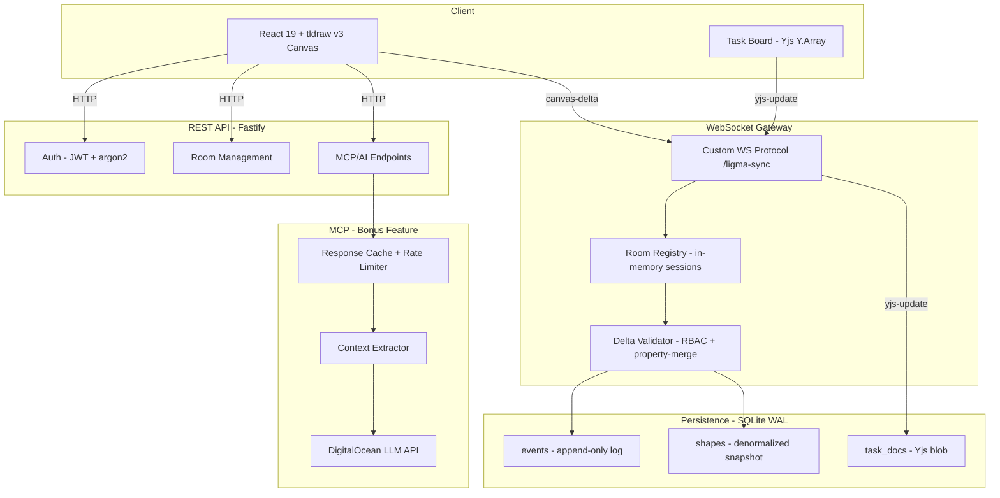

# LIGMA — Real-time Ideation → Execution


ERD Diagram:  [ERD.pdf](https://github.com/user-attachments/files/27209031/erd.updated.pdf)


DevDay '26 Hackathon submission. A live whiteboard that turns brainstorms
into tracked tasks, with role-aware permissions and shareable invite links.

## What's in here
 
```
ligma-hackathon/
├─ apps/
│   ├─ web/        React 19 + Vite + tldraw v3 canvas client
│   └─ server/     Fastify + ws + better-sqlite3 backend (auth, rooms, sync)
└─ packages/
    └─ shared/     Shared types between client and server
```

A single Node process serves the static SPA, the REST API (`/api/*`), and
the WebSocket sync (`/ligma-sync`). SQLite handles persistence.

## Run it locally

Requires **Node 20+** and **npm**.

```bash
npm install
npm run dev
```

- Client: http://localhost:5173 (Vite, proxies `/api` and `/ligma-sync` → server)
- Server: http://localhost:8090

Sign up with any email + password, create a whiteboard, invite collaborators.

### Windows note

`better-sqlite3` and `argon2` need a C++ toolchain. Install Visual Studio
Build Tools (Desktop development with C++) once, then `npm install`.

## Roles

- **Lead** — room creator. Can invite, revoke links, remove members, lock
  shapes to a role tier.
- **Contributor** — can draw, type, move shapes. Sign-in required.
- **Viewer** — read-only. Anonymous Viewer invites skip the login screen
  entirely (browser → live canvas).

## Deploy

The hackathon instance runs on a single VPS (Node + systemd + SQLite WAL).
Build the workspace and copy `apps/web/dist` and `apps/server/dist` to the
target host; `apps/server/dist/db/schema.sql` must travel with the JS.

```bash
npm run -ws build
```

## Hackathon brief

See `Hackathon Task.txt` for the original problem statement.

---

## Architecture Overview



## Conflict Resolution Strategy

LIGMA uses a **hybrid conflict resolution** approach tuned for each data type:

**Canvas Shapes — Property-Level Merge**

When concurrent edits modify different properties of the same shape (e.g., User A moves it while User B recolors it), both changes survive. The server:

1. Receives `[prev, next]` tuples from the client
2. Diffs `prev → next` to extract only the properties the client actually changed
3. Deep-merges those changed properties into the server's authoritative shape state

Same-property conflicts (rare — two users editing the exact same field simultaneously) resolve via last-writer-wins with per-room sequence ordering. This is acceptable because geometric property collisions are uncommon in whiteboard use.

**Task Board — Yjs CRDT**

The task list uses Yjs `Y.Array` for automatic conflict-free convergence. Every task mutation is a Yjs update vector, merged deterministically regardless of arrival order. This guarantees consistency for collaborative text and list reordering where conflicts are frequent.

**Why hybrid?** Full CRDT for every shape property adds complexity and memory overhead with minimal benefit (shapes rarely have same-property collisions). Yjs is reserved for where it matters most — collaborative text and ordered lists.

## Event Sourcing Design

The persistence layer uses a **dual-model** approach:

| Table | Purpose |
|-------|---------|
| `events` | Append-only immutable log. Every mutation records: UUID, per-room sequence number, ISO timestamp, author name, author role, operation type (`created`/`updated`/`deleted`), and full shape JSON. History is never erased — deleting a shape inserts a `deleted` event. |
| `shapes` | Denormalized snapshot of current state per room. Updated atomically on each accepted delta. |

**Why dual-model instead of pure event sourcing?**

Pure event replay grows unbounded (thousands of events per session). On reconnect, a client would need to replay the entire history to reconstruct current state. The `shapes` table provides O(1) current-state retrieval while `events` preserves the full audit trail for timeline replay, undo history, and compliance.

## WebSocket Reconnection Strategy

The protocol is designed for resilient real-time sync over unreliable connections:

1. Client tracks `lastEventSeq` — the sequence number of the last event it received
2. On reconnect, client sends `hello` with its `lastEventSeq`
3. Server responds with `sync-welcome` containing:
   - Full current shapes snapshot (from denormalized `shapes` table)
   - Only events since the client's last sequence number (delta catch-up)
   - Current Yjs task document state
4. Result: **bandwidth-efficient reconnection** — no full state retransmission for brief disconnects
5. **25-second WebSocket keepalive ping** prevents proxy/firewall idle timeouts

## Node-Level RBAC

Per-shape access control enforced at both client and server:

- Shapes carry `meta.ligma.lockedToRoles` — an array of roles permitted to mutate them
- **UI enforcement**: edit controls disabled for unauthorized roles (immediate UX feedback)
- **Server enforcement**: every `canvas-delta` mutation is validated against the shape's lock; unauthorized deltas are rejected with a reason string sent back to the client
- Raw WebSocket bypass is impossible — the server validates every incoming mutation before persisting or broadcasting
- Live role changes (e.g., Lead demotes a Contributor) take effect immediately without page reload via `role-update` messages
- Role hierarchy: **Lead > Contributor > Viewer** — clients can self-demote but never self-elevate past their server-assigned role

## MCP Integration (Bonus Creative Feature)

AI-powered task explanation and diagram generation for whiteboard items:

- **Context extraction**: Proximity-based spatial search finds related tasks within a configurable radius (default 500px). Canvas spatial locality ≈ conceptual relatedness.
- **LLM integration**: DigitalOcean AI API (chat completions) generates structured Markdown explanations and Mermaid diagrams for any task.
- **Caching**: In-memory TTL-based response cache (default 5 min) prevents redundant API calls for the same task.
- **Rate limiting**: Token-bucket algorithm, configurable per-minute limit per user.
- **Access control**: Lead-only — full JWT auth verification on every MCP request.
- **Graceful degradation**: If the API is unavailable or unconfigured, falls back to deterministic diagram generation from task metadata.
- **Observability**: Prometheus-style metrics counters, rolling latency percentiles, daily usage stats, and a health endpoint.

## Key Architectural Decisions

| Decision | Rationale |
|----------|-----------|
| Custom WS protocol over tldraw native sync | Enables server-side RBAC enforcement, immutable event logging, and audit trail — impossible with tldraw's built-in multiplayer |
| SQLite with WAL mode | Concurrent reads + writes for real-time workloads; single-file deployment; no external DB dependency |
| Property-merge for shapes, Yjs CRDT for tasks | CRDT where collaborative text matters; lightweight merge for geometry where same-property collision is rare |
| Frontend-driven intent classification | Offline-first — regex fallback ensures task classification works without network round-trip |
| Proximity-based context extraction | Canvas spatial locality correlates with conceptual relatedness; no manual linking required |
| Dual-model persistence (events + shapes) | Fast reconnect from snapshot; full history preserved for replay and audit |
| 25s WS keepalive ping | Prevents NAT/proxy/firewall idle timeout disconnects without excessive overhead |
| argon2 for password hashing | Memory-hard algorithm resistant to GPU/ASIC attacks; industry best practice over bcrypt |
